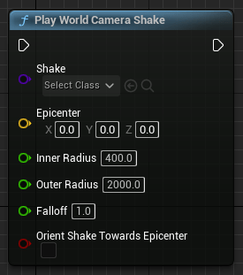
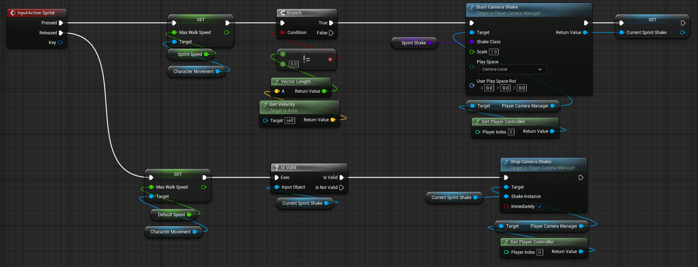
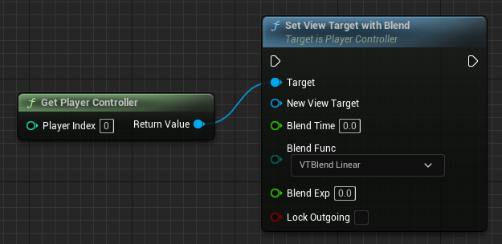

  

## Understanding Camera Actors

- Camera Component

摄像机组件属于摄像机Actor类

- Camera Actor

摄像机Actor是摄像机组件的封装类，这使得它们可以直接放入世界中。

视图窗口 `Show->Advanced->Camera Frustums` 可打开场景中的摄像机视锥范围显示

- Camera Responsibility Chain 摄像机责任链

重要程度或管理顺序依次为：

Camera Component -> Actor or Player Controller -> Player Controller Manager

## Static,Dynamic,and Active Cameras

Types of Camera:

- Static/Fixed 静态或固定摄像机
- Dynamic 动态摄像机
- Active 激活的摄像机

## Using Spring Arms

创建组件 SpringArmsComponent，然后将Camera组件放在它的下一层级

## Common Spring Arm Features

- Socket Offset 
插槽偏移

- Target Offset 
目标偏移

- Camera Collision 
摄像机碰撞

- Use Pawn Control Rotation
使用控制器的旋转控制摄像机旋转

- lag
滞后、延迟
    - Camera Lag 
    摄像机延迟
    - Camera Rotation Lag 
    旋转延迟
    - Camera Lag Speed 
    延迟速度。数值越高，延迟越低。

## Types of Camera Shake 

新建类-> ALL ClASSES 中搜索 `Camera Shake`:

- `CameraShakeBase`
    - `DefaultCameraShakeBase` 和CameraShakeBase的唯一区别是会默认使用柏林噪声
    - `MatineeCameraShake` 旧版摄像机抖动

## Single Shot Shake - Landing Impact

蓝图节点 `Play World Camera Shake`





- Shake 选取CameraShake类的预设
- Epicenter 震中，即抖动输入的位置，代表抖动开始的位置
- Inner Radius 内径，晃动最剧烈的区域
- Outer Radius 外径，影响最远的区域

摄像机是否能够看到震动，与玩家位置无关，取决于摄像机与震中的距离。

在场景中实时测试并查看抖动效果:
1. 确保视口菜单中的 `Realtime` 已开启
2. 在场景中添加一`CameraShakeSourceActor`
3. 在视口菜单中勾选 `Allow Camera Shakes`
4. 菜单栏打开 `Window->Cinematics->Camera Shake Previewer`
5. 视口靠近抖动源，点击`Play`后即可看到抖动效果

## Continuous Camera Shake - Sprinting

编辑器中 `Shit + 鼠标左键` 可展开折叠栏下的所有折叠项

## Switching Cameras with View Target Blend - Method 1

蓝图节点 `Set View Target with Blend`





它会使用“设置混合”函数，随着时间的推移是视图目标过渡到新的Actor

## Switching Cameras with View Target Blend - Method 2

C++的实现方式

## Conclusion to Cameras Framework Essentials for Games