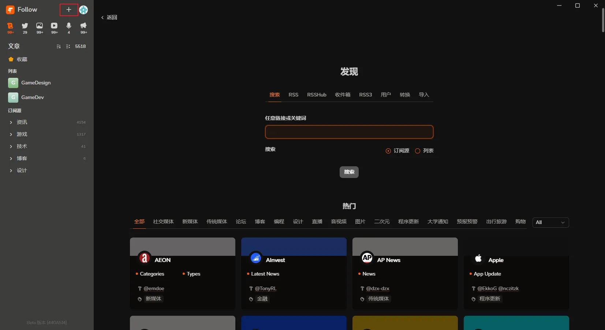
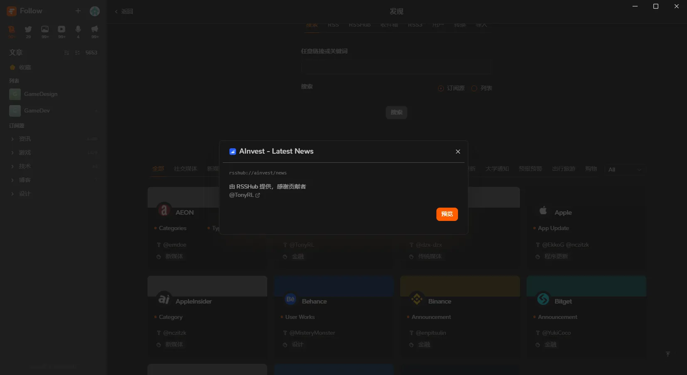
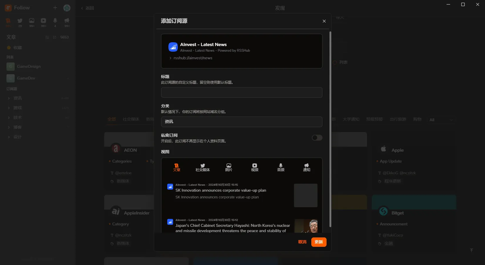
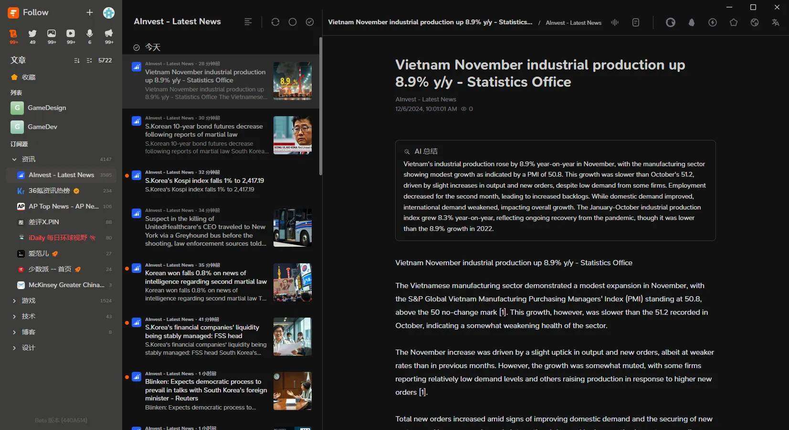
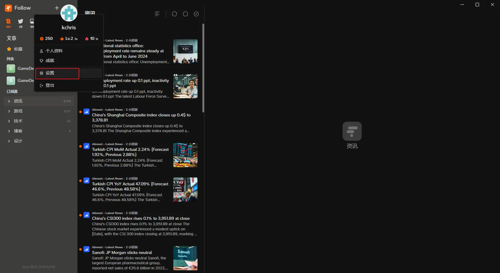
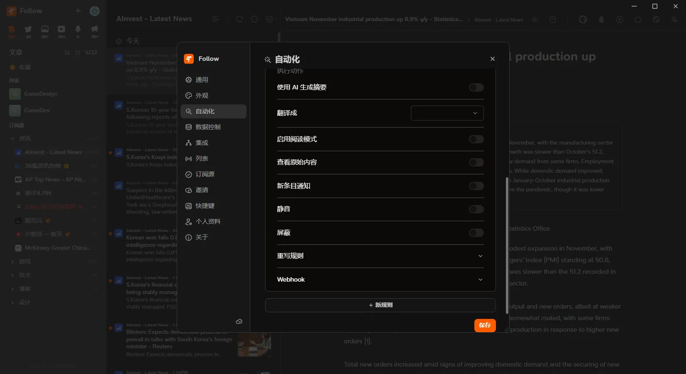
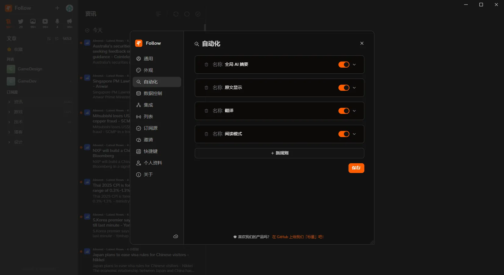
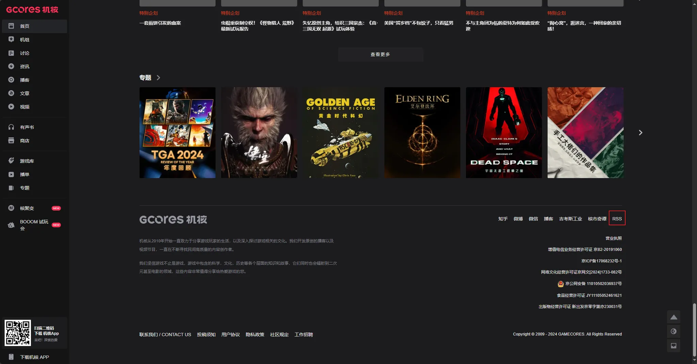
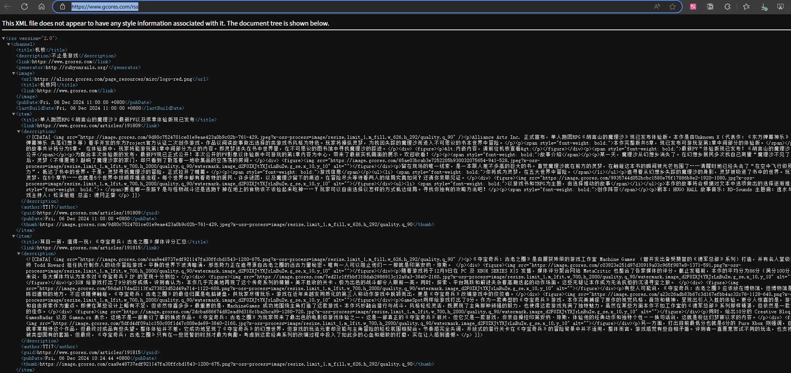

## 背景说明

> ” 我们身处信息爆炸的时代，只是信息爆炸了，但知识并没有爆炸。海量的信息不仅增加了我们甄别筛选知识的难度，还让我们随时随地处于即时信息和肤浅信息的包围中。“

### 需求来源

如今的社会中，信息是个既廉价又宝贵的资源。廉价到通过手机唾手可得，却又在某些时刻，贵重到一个信息差，能拉开人与人之间的社会差距。

在和同事的一次闲聊中，我聊到自己不太喜欢国内这种全家桶式的软件设计。于是他接过话题，开始说到微信这款国民级软件，广告越来越多、刷不到自己想看到的信息…是的，刷不到自己想看到的信息，这也是目前国内主流互联网平台的共通问题所在了。如今的平台靠着大数据和推荐算法在刻意为用户制造对平台有益的“信息茧房”，让用户只看到他们想让用户看到的信息，而这个信息通过一些手段，包装成用户自己想看到的信息。

为了避免这种情况，我开始选择性的过滤掉对自己无用信息，只是这个过程还是浪费了大量时间。随着生活和工作节奏的加快，时间对于我而言成为一个日渐短缺的资源。于是我开始寻求解决方案。

首先确定的一个大方向是，尽可能接触一手信息。基于这个目标，我开始在互联网上搜罗，紧接着了解并接触到 RSS，一种很原始的网站订阅方式。尽管原始，但纵观目前互联网主流平台上的关注、公众号、动态…这些功能的本质也是一种 RSS 订阅，只不过是平台为了完成圈地而制造的新概念，并借机将用户的数字信息据为己有，所获而来的信息通过各种商业模式完成变现。

### 概念说明

- **RSS**
    
    RSS（Really Simple Syndication 或 Rich Site Summary）是一种用于订阅和自动获取网站内容更新的技术和格式。它允许用户通过聚合器（又称 RSS 阅读器）方便地接收和阅读来自不同网站的最新信息，而无需访问每个网站。
    
    早年间的个人博客基本就靠这个来进行传播，只是现在平台垄断越发明显，个人RSS成为孤岛，难以为继。
    
- **RSS 阅读器**
    
    RSS 阅读器是一种专门用于订阅、聚合和管理 RSS Feed 的工具或应用程序。通过 RSS 阅读器，用户可以集中查看来自不同网站的最新内容，而无需频繁访问每个网站。这种工具对于希望跟踪多个新闻来源、博客、播客或其他内容发布平台的用户尤其有用。
    

## 软件简介


简介内容由AI总结输出。


RSS 工具 Follow 主要面向互联网用户，尤其是那些希望方便快捷地获取信息和内容的用户。

### 软件简要描述：

Follow 是一款现代化的 RSS 阅读器，旨在帮助用户方便地订阅和管理各种内容源。其主要功能包括：

- **用户友好的界面**：简单直观的设计，让用户能够快速找到所需的信息。
- **多源订阅**：支持多种类型的 RSS 源订阅，用户可以根据自己的需求自由选择。
- **内容分类**：提供分类管理功能，帮助用户将不同主题的内容进行整理。
- **离线功能**：支持离线阅读，用户可以在没有网络连接时访问之前存储的内容。
- **跨设备同步**：支持账户同步功能，用户在任何设备上都能获取最新的订阅更新。
- **推送通知**：实时推送最新更新，确保用户不会错过重要信息。

### 衍生内容：

除了 Follow，用户也可以探索其他类似的 RSS 工具和应用，如 Feedly、Inoreader 和 The Old Reader。这些工具各有特点，如 Feedly 强调社交功能，Inoreader 提供高级订阅管理选项，而 The Old Reader 则更注重简洁的阅读体验。用户可以根据自身需求，选择最合适的工具来管理自己的信息获取方式。

## 使用说明

### 软件安装

- 可以直接从官网下载对应平台安装包。

    - [Follow](https://follow.is/)

- 如果能访问外网的话，也可以从 GitHub 上找到最新的 Release 下载。

    - https://github.com/RSSNext/Follow

### 软件配置

- **订阅源配置**
    1. 点击“+”，打开发现页面。
        
        
        
    2. 选择感兴趣的信息源。
        优先选择热门推荐的信息源（比较稳定）。

        
        
        
    3. 点击“预览”，选择分组，完成订阅。
        
        
        
    4. 订阅的信息源会在左侧栏中显示，接着便可以像微信公众号一样进行信息浏览了。
        
        
        
- **自动化配置**
    
    在设置页面中可以找到一些诸如：AI摘要、翻译、阅读模式、原文显示等自动化的规则设置，这部分属于个人定制化的操作了，可以匹配个人习惯自动完成一些重复操作。
    
    

    

    
    

### 信息源获取

除了软件发现页面推荐的信息源，我们还可以自己选择信息源，应该说这才是我们使用这个软件的本质目的——打造一套自己的信息流。

信息源的获取有以下几种途径：

- **网站 RSS 链接**
    1. 一般允许被订阅的网站都会带有“RSS”图形或是文字标识，点击后即可获得订阅链接。这个属于官方的订阅链接了，优先推荐。
    
    
    
    
    
    
    
- **RSS 生成器（第三方）**
    1. 如果第一种方式是官方行为，那么这种方式可以戏称为“民间行为”了。调侃归调侃，互联网本身就是主打开源精神，RSS从道德层面上来讲本身就是面向开放给所有人的。只是当代互联网平台通过利益绑架了这种开源精神，所以才有了民间开源。
    2. 目前主流的第三方RSS生成器是RSSHub，通过浏览器插件，可以快速获取到未开放RSS网站的订阅链接。Follow 软件的前身就是 RSSHub。有兴趣的朋友可以去官方了解下。
    
    [介绍 | RSSHub](https://rsshub.netlify.app/zh/)
    
- **RSS 生成器（自建）**
    1. 由于第三方生成器并不能保证提供所有个人想订阅的网站RSS，且数据更新并非及时有效。所以有需求的同学可以自行搭建，通过自己本地主机或服务器生成有效的网页数据RSS。
    2. 具体搭建方式可见上述 RSSHub 官网介绍。

## 使用感受

总的来说，这款软件还是比较符合我个人诉求的。

不过依然存在以下不足：

- 订阅源经常失效
- 信息相较于网站来说更新不及时，受限于订阅源服务器的更新频率。

当然以上问题也是有解决方案，就是根据自己的诉求自建一个专属RSS源。现阶段的我实在没精力再往下折腾了，等后面有空再折腾下看看效果。

回归软件本身的工具属性而言，这款软件已经做得很棒了！对于使用者来说，更重要还是信息源。搜寻并整理自己所需信息，进行持续的价值积累，才是这款软件的意义所在。