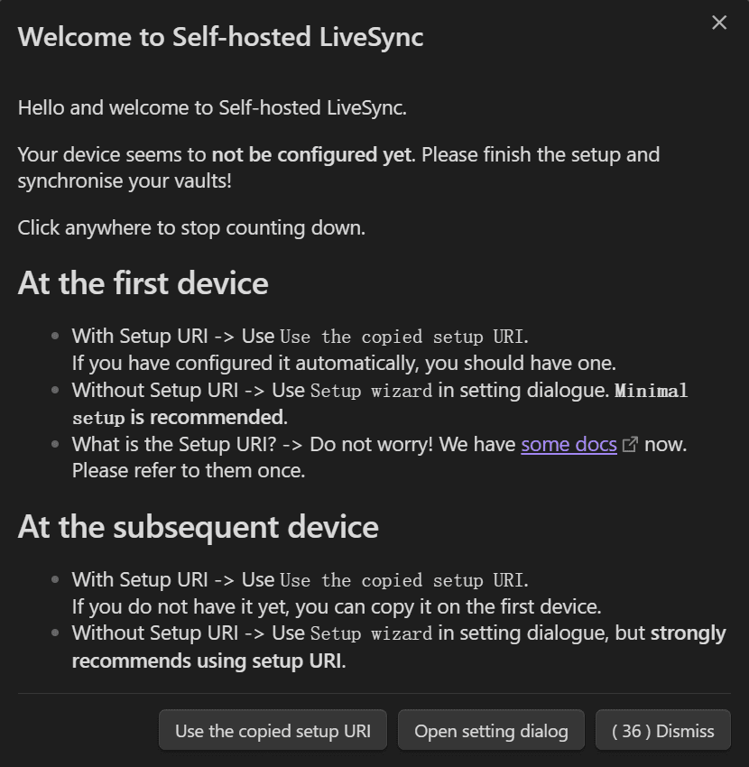
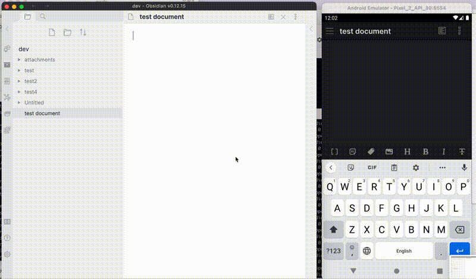

## 需求来源
自从折腾过自己的服务器，就老想着让服务器的价值最大化，真的就停不下来。思来想去，刚好最近有一个笔记数据多端同步的诉求，以便随时查阅。
你问我怎么不直接上Notion或是其他类似的笔记软件？
不好意思，是真怕它们跑路，数据放自己手里才是最安心的。加上离线运行效率还是要比在线高出不少，查找数据更加快捷，最终选择了Obsidian+多端同步的组合方案。


## 方案分析

### 云盘
这个是我目前在用的方式，微软的OneDrive和百度云的同步空间都用过。 PC端的同步体验目前来说还不错，只是在手机和Pad上的同步体验就有些差强人意了。主要表现在手机数据管理不便，以及软件常驻后台的可操作性不大。

如果不想折腾，或是没有随时随地的查看诉求，我还是比较推荐微软OneDrive的方案。


### 插件
得益于 Obsidian 成熟的插件市场，搜索后如下：


一般来说优先下载量和最近更新日期作为选择标准，于是我选择了 `Self-hosted LiveSync` 这款插件。不是 `Remotely Save` 不够好，而是 `Self-hosted LiveSync` 的名字更深得我心。论取名的艺术~


## 方案详情
需要提前准备一台安装有 Docker 的服务器和一台安装有 Obsidian 的客户端。

### 服务器配置

#### 配置 CouchDB 
新建文件 `local.ini` 上传至服务器并获得路径地址

```
[couchdb]
single_node=true
max_document_size = 50000000

[chttpd]
require_valid_user = true
max_http_request_size = 4294967296

[chttpd_auth]
require_valid_user = true
authentication_redirect = /_utils/session.html

[httpd]
WWW-Authenticate = Basic realm="couchdb"
enable_cors = true

[cors]
origins = app://obsidian.md,capacitor://localhost,http://localhost
credentials = true
headers = accept, authorization, content-type, origin, referer
methods = GET, PUT, POST, HEAD, DELETE
max_age = 3600
```


#### 部署 CounchDB
- Dokcer 安装
通过 `local.ini` 配置，在Docker中运行 CouchDB:

```docker
docker run -d --restart always 
-e COUCHDB_USER=admin                       #admin改成自己的用户名
-e COUCHDB_PASSWORD=password                #password改成自己设定的密码
-v /path/to/local.ini:/opt/couchdb/etc/local.ini
-p 5984:5984 
couchdb
```

其中 `/path/to/local.ini` 替换成实际的文件存放路径。

- Docekr Compose 安装
创建一个文件夹, 将你的 `local.ini` 放在文件夹内, 然后在文件夹内创建 `docker-compose.yml`. 请确保对 `local.ini` 有读写权限并且确保在容器运行后能创建 `data` 文件夹. 文件夹结构大概如下:

```
obsidian-livesync
├── docker-compose.yml
└── local.ini
```

参照以下内容编辑 `docker-compose.yml` :

```docker
version: "2.1"
services:
  couchdb:
    image: couchdb
    container_name: obsidian-livesync
    user: 1000:1000
    environment:
      - COUCHDB_USER=admin                    #admin改成自己的用户名
      - COUCHDB_PASSWORD=password             #password改成自己设定的密码
    volumes:
      - ./data:/opt/couchdb/data
      - ./local.ini:/opt/couchdb/etc/local.ini
    ports:
      - 5984:5984
    restart: unless-stopped
```

创建并启动容器：

```docker
docker-compose up -d
```

#### 新建数据库
1. 访问 `http://localhost:5984/_utils` ，输入部署容器时配置好的账号和密码。
2. 点击 `Create Database` ，根据个人喜好创建数据库，名称随便。


#### 设置域名
设置一个指向你服务器的 A 记录，并在服务器端通过 `Nignx/Caddy` 获取 SSL 证书。
这一步主要目的是获取合法的SSL，不然客户端插件无法与同步服务器建立连接。


### 插件配置

#### 安装插件
应用市场搜索 `Self-hosted LiveSync` ，并安装启用。
首次启用会打开如下页面（可以忽略）： 



#### 配置插件
1. 设置向导 (The Setup wizard)
在设置对话框中打开 `🧙‍♂️ Setup wizard`. 如果之前未配置插件, 则会自动打开该页面。


- `Use`: 使用已有配置，一般用于第二台及之后的设备的配置。
- `Start`: 根据引导进行配置。一般用于第一台设备配置，根据引导进行一些简单且必要的配置。
- `Enable`: 根据个人喜好进行手动配置。


2. 配置远程数据库
在引导页面点击 `Start` 后弹出如下页面：


- Remote Database configuration
  - 依次输入服务器地址、用户名、密码和数据库名称。
  - 点击 `Check` 按钮进行连通性测试。

- Confidentiality
  - End to End Enctryption ： 是否启用端到端加密。推荐勾选。
  - Passphrase : 设置加密密码。
  - Path Obfuscation : 混淆路径。多一重加密保证，推荐勾选。

配置完成点击 `Next` 。

3. 同步设置


选择自己要使用的同步方法，推荐 `LiveSync` ，也是这个插件比较特色的同步方式了。 然后点击 `Apply` 初始化并按要求建立本地和远程数据库。如果显示 `All done!` ，就完成了全部配置。此时 `Copy setup URI` 将自动打开，并要求我们输入密码以加密 `Setup URI` 。

之后等待本地与服务器完成同步。当状态不再变化并显示 ⏹️ 图标表示 COMPLETED（没有 ⏳ 和 🧩 图标）时，您就可以与服务器同步了。

4. 后续设备的配置 
通过首次启用插件的弹窗或是设置向导 (The Setup wizard)中选择 `Use the copied setup URI` ，点击 `Use` , 输入前置 `Copy setup URI` 中复制的链接并输入密码。在弹窗中选择以下内容：
- `Importing LiveSync's conf, OK?` 选择 `Yes`
- `How would you like to set it up?` 选择 `Set it up as secondary or subsequent device`
然后，配置将生效并开始复制。接着，等待文件完成同步。

5. 详细配置
更多配置说明详见官方文档：
  


### 使用说明

同步状态将显示在状态栏。

- 状态
  - ⏹️ 就绪
  - 💤 LiveSync 已启用，正在等待更改。
  - ⚡️ 同步中。
  - ⚠ 一个错误出现了。
  - ↑ 上传的 chunk 和元数据数量
  - ↓ 下载的 chunk 和元数据数量
  - ⏳ 等待的过程的数量
  - 🧩 正在等待 chunk 的文件数量 如果你删除或更名了文件，请等待 ⏳ 图标消失。

- 提示
  - 如果文件夹在复制后变为空，则默认情况下该文件夹会被删除。您可以在同步设置中关闭此行为。
  - 移动平台上的 Obsidian 无法连接到非安全 (HTTP) 或本地签名的服务器，即使设备上安装了根证书。
  - 同步时，文件按修改时间进行比较，较旧的将被较新的文件覆盖。然后插件检查冲突，如果需要合并，将打开一个对话框。
  - 使用此插件时，应避免同时使用其他同步软件。


## 总结
在各种终端设备上尝试使用下来确实感觉不错，如官方所述，几乎达到了一字一句的实时同步。


不过之前在用 `cloudflare` 做域名解析时，还是会存在同步不及时的情况。后来拿 `Aliyun` 做域名解析就好了很多。推荐大家还是选择自己所在网络更好的域名及服务器运营商。
