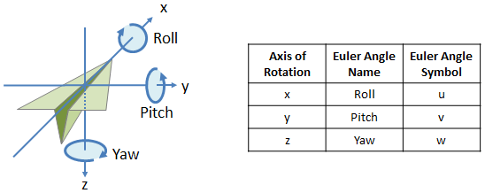
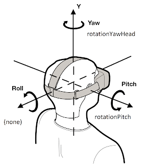
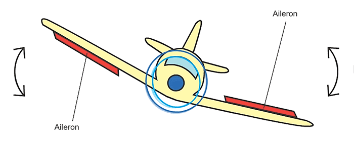
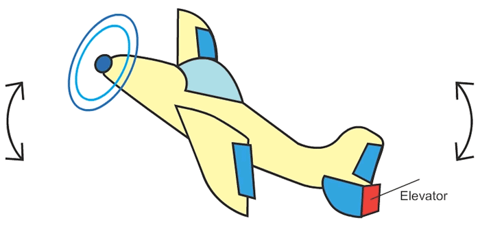
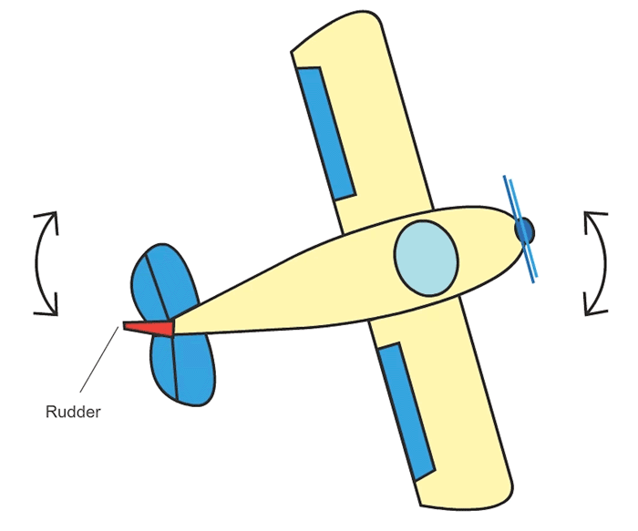
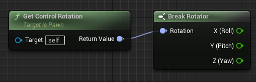

"Roll"、"Pitch" 和 "Yaw" 是航空航天和机器人领域中用于描述物体或飞行器在三个不同轴上的旋转运动。





- `"Roll"（翻滚）`是绕物体的纵轴（前后轴）旋转，使其绕横向轴产生旋转运动。类比于飞行器，翻滚是指飞机绕其纵轴（从头到尾的轴线）进行的旋转运动，即向左或向右倾斜。

- `"Pitch"（俯仰）`是绕物体的横轴（侧向轴）旋转，使其绕纵向轴产生旋转运动。在飞行器的背后，俯仰是指飞机绕其横轴（从一侧到另一侧的轴线）进行的旋转运动，即向上或向下倾斜。

- `"Yaw"（偏航）`是绕物体的垂直轴（竖直轴）旋转，使其绕垂直轴产生旋转运动。对于飞行器，偏航是指飞机绕其垂直轴（通过飞机重心向上的轴线）进行的旋转运动，即左右转向。

这三个名词在Unreal蓝图三维向量节点中经常会出现：

